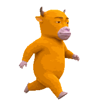
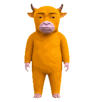
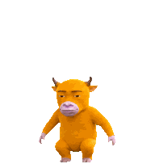
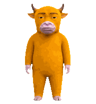
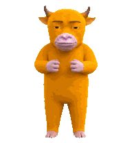
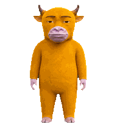
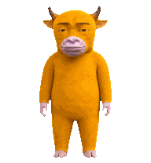
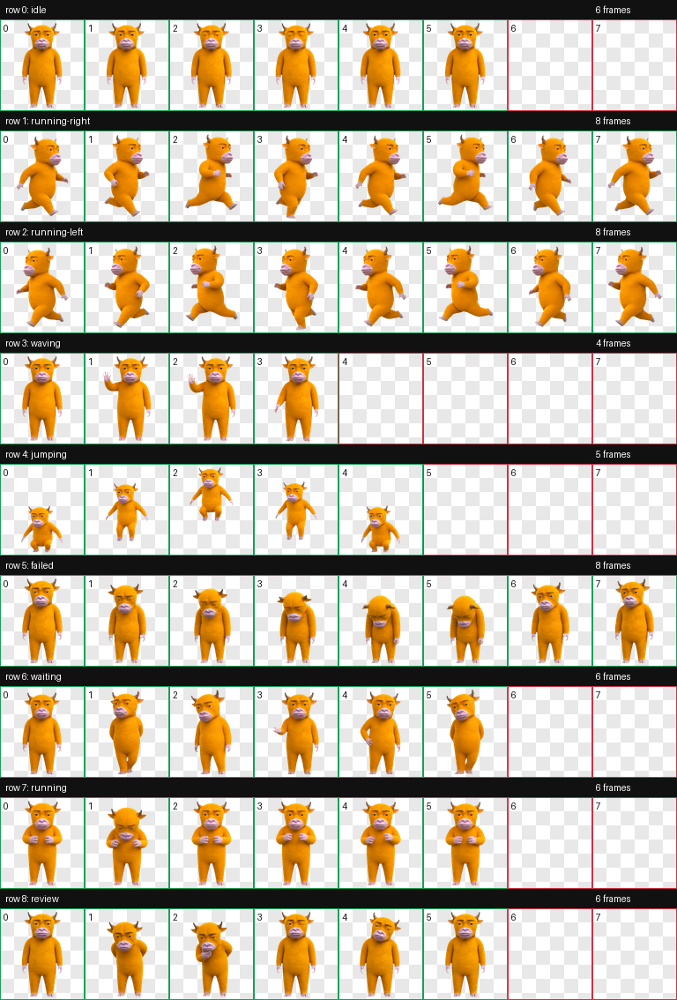

<p align="center">
  
  
  
</p>

<h1 align="center">牛来，来到 Codex。</h1>

<p align="center">
  <strong>它会跑、会跳、会挥手。<br />你在干活，它在旁边一脸严肃地看着。</strong>
</p>

<p align="center">
  低分辨率 · 弱纹理 · 早期 CGI · 完整 Codex Pet 九状态动画
</p>

## 30 秒安装

### macOS / Linux

复制下面这一段：

```bash
git clone https://github.com/siwei-yuan/niulai-codex-pet.git && cd niulai-codex-pet && ./scripts/install.sh
```

### Windows

```powershell
git clone https://github.com/siwei-yuan/niulai-codex-pet.git; cd niulai-codex-pet; powershell -ExecutionPolicy Bypass -File .\scripts\install.ps1
```

然后只需两步：

1. 打开 Codex Desktop 的 `Settings → Pets`
2. 点击 `Refresh`，选择「牛来」

完事。

> 已经下载过仓库？在仓库目录里直接运行 `./scripts/install.sh` 即可。

## 它真的会动

<p align="center">
  
  
  
  
</p>

| Codex 状态 | 牛来的反应 |
| --- | --- |
| 待机 | 呼吸、眨眼，严肃站岗 |
| 向左 / 向右移动 | 僵硬但很有力地赶路 |
| 挥手 | 不苟言笑地跟你打招呼 |
| 跳跃 | 原地蓄力、腾空、落地 |
| 任务失败 | 低头、塌肩，陷入沉思 |
| 等待输入 | 侧看、摊手，等你决定 |
| 任务执行中 | 低头专注处理，手上一直没停 |
| 检查结果 | 前倾、眯眼、托腮审查 |

<details>
<summary><strong>查看完整九行精灵动画接触表</strong></summary>



</details>

## 手动安装

实际运行只需两个文件：

```text
pet.json
spritesheet.webp
```

把它们放到：

```text
${CODEX_HOME:-$HOME/.codex}/pets/niulai/
```

再到 Codex Desktop 的 Pets 设置中点击 `Refresh`。

## 技术信息

- Codex Pet 官方协议尺寸：1536×1872
- WebP + RGBA 透明通道
- 8 列 × 9 行动画精灵表
- 未使用单元格全透明
- 9 种完整 Codex 状态，共 57 帧

可选的本地验证：

```bash
python3 scripts/validate_pet.py
```

## 二次创作声明

这是粉丝向、非商业的二次创作桌宠，与原作版权方、制作方及 OpenAI 无官方关联。公开分发前请自行确认相关角色与名称的授权范围。

更完整的声明见 [NOTICE.md](NOTICE.md)。
